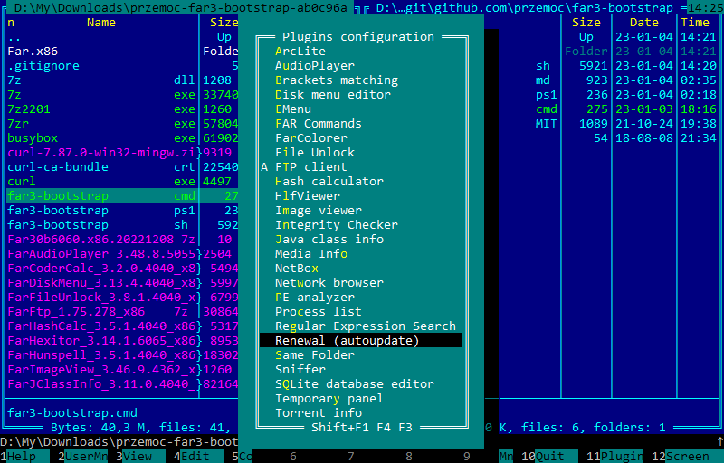

far3-bootstrap
==============

Far Manager v3 bootstrap scripts for downloading:
- [Far Manager v3.0 stable build](https://www.farmanager.com/download.php?l=en)
- [FarPlugs](https://farplugs.sourceforge.io/?en) - plugins collection
- [Integrity Checker](https://plugring.farmanager.com/plugin.php?l=en&pid=893)
- [Regular Expression Search and Replace (RESearch)](https://plugring.farmanager.com/plugin.php?pid=246)

Usage
-----

- Download https://git.io/far3-bootstrap.zip archive
- Extract its content
- Enter newly created `przemoc-far3-bootstrap-???????` directory
- Run
  - On Windows (old):
    `far3-bootstrap.cmd`
  - On Windows 10+:
    `far3-bootstrap.ps1`
  - On Linux:
    `far3-bootstrap.sh`
- Enter newly created `Far.x??` directory
- Run `Far.exe`
- Further update plugins using Renewal (via F11)

Far Manager v3 screenshot
-------------------------

License
-------

Scripts are licensed under the terms of the MIT license.
https://spdx.org/licenses/MIT.html
